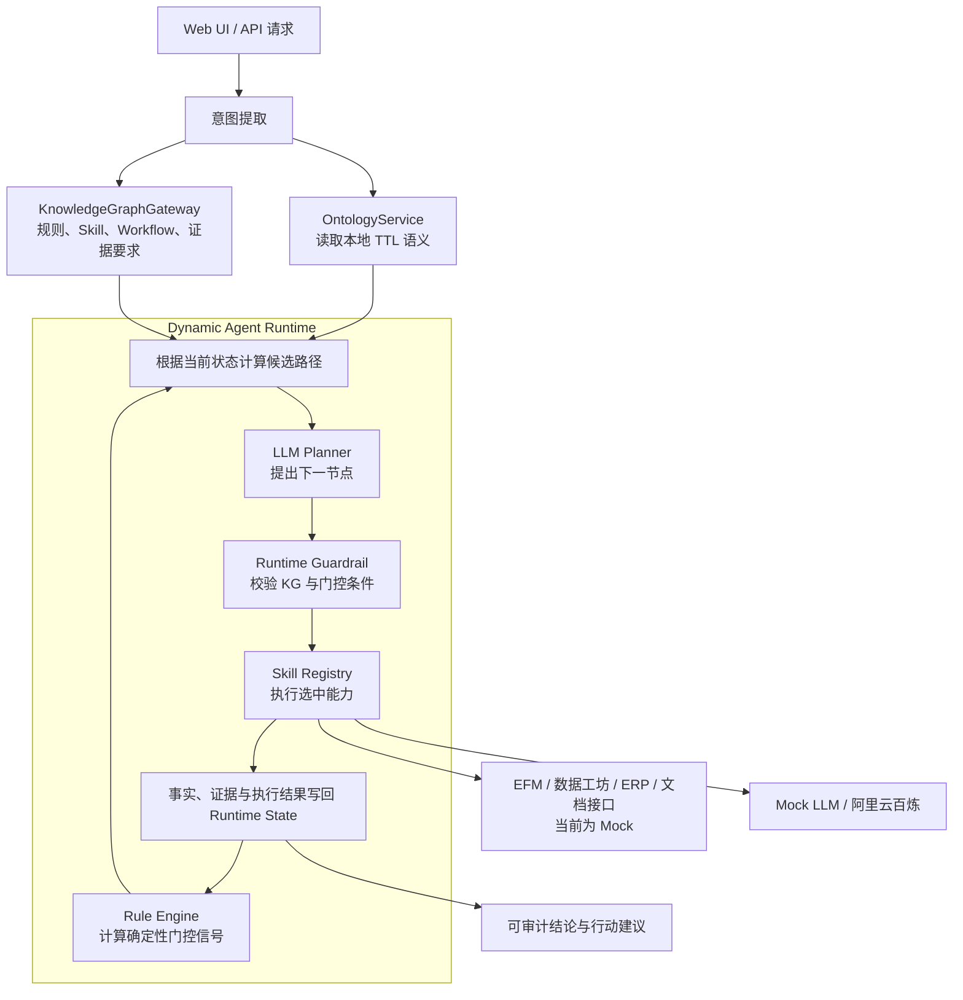

# 财报异常分析 Knowledge + Data Driven Agent

这是一个可本地运行的财报异常分析 Agent 演示工程。它以 RDF/TTL 本体统一领域语义，由知识图谱返回规则、Skill 与条件执行图，按需获取财务事实，再通过确定性规则、LLM Planner 和 Runtime Guardrail 动态决定下一步。

项目以“收到的政府补助（`DCF0103`）异常波动”为示例，重点展示：同一个分析任务如何因实时数据和证据完整性不同，走出不同的实际执行路径，并生成可追溯的事实、规则、证据、结论和行动建议。

> 默认使用完全离线的 Mock 模式，无需 API Key。切换到阿里云百炼后，每轮 Planner 决策和最终结论会调用真实模型；知识图谱、财务数据与证据接口仍是 Mock 实现。

## 核心能力

- **领域语义建模**：使用 RDF/TTL 描述报表、报表项、规则、波动、业务事件、证据、分析方法、Skill、结论与行动。
- **KG 驱动执行图**：规则、节点、Skill、条件路径和证据要求由 Knowledge Graph Gateway 返回，不在编排器中固化线性业务步骤。
- **事实按需获取**：只有选中对应 Skill 时，才获取整体报表事实、明细贡献项或业务证据。
- **确定性规则门控**：阈值判断由 Rule Engine 执行，LLM 不负责重算规则结果。
- **逐轮动态规划**：LLM Planner 每轮只从 KG 给出的候选路径中选择一个下一节点。
- **运行时安全兜底**：Guardrail 会拒绝非法节点、错误 Skill 或不满足条件的路径，并回退到 KG 允许的合法路径。
- **可审计结果聚合**：Runtime 持久维护本次运行的事实、规则结果、Planner 历史、执行路径、审计依据和证据链；最终结果会与 LLM 输出合并，避免模型漏字段导致审计信息丢失。
- **可感知 SSE 流式 UI**：后端逐事件输出，前端通过 Event Queue 与 `requestAnimationFrame` 逐条渲染 Planner 生命周期。
- **双 LLM Provider**：支持离线 `mock` 和阿里云百炼 OpenAI Compatible API。

## 设计原则

```text
领域知识定义：可以怎样分析
实时数据说明：当前发生了什么
确定性规则判断：哪些路径此刻成立
LLM Planner 选择：下一步执行哪个 Skill
Runtime Guardrail 保证：只能执行 KG 允许的合法路径
```

编排器实现的是通用循环，而不是固定的 `Step 1 → Step 2 → Step 3`：



## 一次分析如何执行

1. `AnalysisRequest` 接收自然语言查询和可选结构化字段。
2. Agent 从查询中提取公司、报表项和期间；缺失时使用演示默认值 `0021G`、`DCF0103`、`2026P06`。
3. `OntologyService` 从 TTL 本体中查找报表项语义与关系。
4. `MockKnowledgeGraphGateway` 返回分析方法、规则、原子 Skill、动态 Workflow、证据要求和 Planner Skill 元数据。
5. Runtime 根据当前节点、规则结果和证据状态计算全部候选 transition，并标记允许或阻断。
6. Planner 读取 YAML 专家策略、KG 知识、当前事实和候选路径，提出一个下一节点。
7. Guardrail 校验 Planner 选择；通过后由 `SkillRegistry` 调用对应执行器。
8. 新事实写入 Runtime State，Rule Engine 计算阈值或证据完整性门控信号。
9. Runtime 进入下一轮，直到执行结论生成 Skill；最多允许 12 轮，防止错误 Workflow 形成无限循环。
10. 最终响应合并 Runtime 审计数据和 LLM 结果，输出完整执行轨迹。

## 知识、数据与模型的职责边界

| 组件 | 当前实现 | 负责内容 | 不负责内容 |
| --- | --- | --- | --- |
| Ontology | `rdflib` 读取本地 TTL | 领域对象、关系和核心语义 | 实时金额、动态路径选择 |
| Knowledge Graph Gateway | Mock Python 数据结构 | 适用规则、Skill、Workflow、条件边、证据要求 | 执行 Skill、计算阈值 |
| Planner Skill | YAML 策略 + LLM | 在合法候选中选择一个下一 Skill | 创建新路径、自行修改规则结果 |
| Fact Data Gateway | Mock EFM/明细/ERP/文件接口 | 返回本次场景的事实与证据 | 决定分析流程 |
| Rule Engine | 本地确定性代码 | 比较实际值与 KG 阈值、判断证据完整性 | 生成业务原因或模型推断 |
| Runtime Guardrail | 本地确定性代码 | 校验节点、Skill 和 transition 是否合法 | 替代 Planner 做开放式推理 |
| Conclusion Skill | Mock 逻辑或百炼 | 基于已执行路径生成结构化结论 | 使用未取到的数据或虚构证据 |

## 内置规则与动态路径

演示 KG 定义两条阈值规则：

| 规则 | 指标 | 条件 | 触发后动作 |
| --- | --- | --- | --- |
| `RULE_DCF0103_OVERALL_20` | `changeRate` | `>= 0.20` | 进入明细下钻 |
| `RULE_DCF0103_DETAIL_50` | `majorContributorChangeRate` | `> 0.50` | 检索业务事件与证据 |

证据完整性要求同时满足：

- `DocumentEvidence`：政府补助/项目批复文件；
- `DataEvidence`：到账会计分录。

### 四个可复现场景

| `scenario` | 关键数据/门控 | 实际执行路径 | 结果 |
| --- | --- | --- | --- |
| `government_subsidy_with_evidence` | 整体 35%，主要贡献项 769.23%，证据 2/2 | `FETCH_EFM → FETCH_DETAIL → RETRIEVE_EVIDENCE → GENERATE_CONCLUSION` | 证据完整，判断为合理波动 |
| `low_fluctuation` | 整体 5%，未达到 20% | `FETCH_EFM → GENERATE_CONCLUSION` | 提前结束深度下钻 |
| `high_overall_low_detail` | 整体 35%，最大明细 25%，未达到 50% | `FETCH_EFM → FETCH_DETAIL → GENERATE_CONCLUSION` | 跳过证据检索 |
| `high_fluctuation_no_evidence` | 整体与明细规则均触发，文件证据缺失 | `FETCH_EFM → FETCH_DETAIL → RETRIEVE_EVIDENCE → REQUEST_MANUAL_EVIDENCE → GENERATE_CONCLUSION` | 形成暂定结论与人工补证待办 |

表中的短名称对应代码里的 `SKILL_*` 标识。完整期望输出可参考 [`docs/dynamic_path_examples.json`](docs/dynamic_path_examples.json)。

## 快速开始

### 环境要求

- Python 3.11+，推荐 Python 3.12；
- `pip`；
- 可选：Docker / Docker Compose；
- 仅在百炼模式下需要可用的 API Key 和网络连接。

### 本地运行

克隆并进入仓库：

```bash
git clone git@github.com:cat-coco/ontology.git
cd ontology
```

创建虚拟环境：

```bash
python3 -m venv .venv
```

macOS / Linux：

```bash
source .venv/bin/activate
```

Windows PowerShell：

```powershell
.\.venv\Scripts\Activate.ps1
```

安装依赖并创建本地配置：

```bash
python -m pip install -r requirements.txt
cp .env.example .env
```

Windows 可使用：

```bat
copy .env.example .env
```

启动服务：

```bash
python -m uvicorn app.main:app --host 127.0.0.1 --port 8000 --reload
```

也可以在 macOS / Linux 运行 `./run.sh`，或在 Windows 运行 `run.bat`。

打开浏览器访问：

```text
http://127.0.0.1:8000
```

默认配置为 `LLM_PROVIDER=mock`，无需 API Key 即可运行四种完整场景。

### Docker Compose

```bash
cp .env.example .env
docker compose up --build
```

服务会映射到 `http://127.0.0.1:8000`。`docker-compose.yml` 使用 `.env` 作为容器环境文件，因此启动前必须先创建它。

## 配置

| 环境变量 | 默认值 | 说明 |
| --- | --- | --- |
| `LLM_PROVIDER` | `mock` | `mock` 或 `bailian`；其他值也会回退到 Mock |
| `BAILIAN_API_KEY` | 空 | 百炼 API Key，仅 `bailian` 模式必填 |
| `BAILIAN_BASE_URL` | `https://dashscope.aliyuncs.com/compatible-mode/v1` | OpenAI Compatible Base URL |
| `BAILIAN_MODEL` | `qwen3.7-plus` | 百炼模型名称，需确保当前账号可用 |
| `APP_HOST` | `127.0.0.1` | 作为已导出的 Shell 环境变量运行 `run.sh` 时使用的监听地址 |
| `APP_PORT` | `8000` | 作为已导出的 Shell 环境变量运行 `run.sh` 时使用的监听端口 |
| `STREAM_DEMO_DELAY_MS` | `160` | Mock 模式下后端 SSE 事件之间的演示节奏 |
| `UI_EVENT_DELAY_MS` | `180` | 前端事件队列的最小展示间隔 |

### 切换到阿里云百炼

编辑 `.env`：

```env
LLM_PROVIDER=bailian
BAILIAN_API_KEY=你的_API_KEY
BAILIAN_BASE_URL=https://dashscope.aliyuncs.com/compatible-mode/v1
BAILIAN_MODEL=qwen3.7-plus
```

百炼模式下：

- 每个 Planner Round 调用一次模型选择下一 Skill；
- `SKILL_GENERATE_CONCLUSION` 再调用模型生成结构化结论；
- 模型必须支持 OpenAI Compatible Chat Completions 和 JSON Object 输出；
- 即使模型选择了非法路径，Runtime Guardrail 仍只允许执行 KG 当前合法的 transition；
- `.env` 已被 Git 忽略，不要把真实 Key 写入 `.env.example` 或其他受版本控制文件。

## API

### 端点

| 方法 | 路径 | 用途 |
| --- | --- | --- |
| `GET` | `/` | Planner Control Room 演示页面 |
| `GET` | `/api/health` | 服务状态、Provider、模型和流式配置 |
| `GET` | `/api/ontology/core` | 核心本体语义与三元组数量 |
| `GET` | `/api/kg/workflow` | 演示 KG 返回的动态 WorkflowDefinition |
| `POST` | `/api/analyze` | 同步执行并返回完整分析结果 |
| `POST` | `/api/analyze/stream` | 以 Server-Sent Events 返回逐步执行过程 |

FastAPI 自动接口文档：

- Swagger UI：`http://127.0.0.1:8000/docs`
- ReDoc：`http://127.0.0.1:8000/redoc`

### 请求结构

| 字段 | 必填 | 默认值 | 说明 |
| --- | --- | --- | --- |
| `query` | 是 | 无 | 自然语言查询；可从中识别公司、期间和报表项 |
| `entity` | 否 | 从查询提取，否则 `0021G` | 显式公司编码 |
| `report_item` | 否 | 从查询提取，否则 `DCF0103` | 显式报表项编码 |
| `period` | 否 | 从查询提取，否则 `2026P06` | 显式期间 |
| `scenario` | 否 | `government_subsidy_with_evidence` | 选择四种 Mock 数据场景之一 |

同步调用示例：

```bash
curl -X POST http://127.0.0.1:8000/api/analyze \
  -H 'Content-Type: application/json' \
  -d '{
    "query": "分析0021G 2026P06 DCF0103异常波动",
    "scenario": "government_subsidy_with_evidence"
  }'
```

SSE 调用示例：

```bash
curl -N -X POST http://127.0.0.1:8000/api/analyze/stream \
  -H 'Content-Type: application/json' \
  -H 'Accept: text/event-stream' \
  -d '{
    "query": "分析0021G 2026P06 DCF0103异常波动",
    "scenario": "high_fluctuation_no_evidence"
  }'
```

更多示例见 [`docs/api_examples.md`](docs/api_examples.md)。

## SSE 事件生命周期

每一轮 Planner 会输出结构化输入、门控状态、选择结果和执行结果，而不是暴露模型的私有 Chain-of-Thought：

```text
started
knowledge
kg

planner_round
planner_candidates
planner_call
planner
guardrail
step / skill_call
fact / evidence
rule_results
reasoning
state_update

... 下一轮 ...

complete
```

前端不会直接按网络 chunk 批量更新 DOM。它先解析 SSE 消息并放入 Event Queue，再逐条执行 `handle()`，在事件之间使用 `requestAnimationFrame()` 和可配置延迟让浏览器完成绘制。因此，即使多条 SSE 被合并到一次 `ReadableStream.read()`，界面仍会依次展示 Planner、Guardrail、Skill 和状态更新。

详细事件说明见 [`docs/streaming_api.md`](docs/streaming_api.md)。

## 返回结果与审计数据

同步接口和 SSE 的 `complete` 事件最终返回：

| 字段 | 内容 |
| --- | --- |
| `trace_id` | 本次分析的唯一追踪标识 |
| `intent` | 结构化公司、报表项、期间、任务类型和场景 |
| `ontology` | 报表项本体上下文与核心语义 |
| `kg_response` | 本次使用的规则、Skill、Workflow 和证据要求 |
| `runtime_state` | 事实、规则结果、执行历史、Planner 历史、审计依据和证据链 |
| `rule_results` | 确定性 Rule Engine 的结构化结果 |
| `planner_decisions` | 每轮选择、依据、置信度、Provider 和 Guardrail 回退标记 |
| `agent_steps` | 实际完成的 Skill 步骤及调用结果 |
| `final_report` | 事实、推理依据、证据链、结论、行动和审计元数据 |
| `llm_provider` | 本次运行使用的 Provider |

`final_report.reasoning` 和 `final_report.evidence_chain` 不只依赖模型返回。Orchestrator 会将它们与 `runtime_state.audit_reasoning`、`runtime_state.evidence_chain` 以及事实接口返回的证据合并去重，并在 `audit_meta` 中记录数量和来源。

## 项目结构

```text
.
├── app/
│   ├── main.py                         # FastAPI、静态页面和同步/SSE API
│   ├── config.py                       # 环境变量配置
│   ├── models.py                       # Pydantic 请求、状态与响应模型
│   ├── agent/
│   │   ├── orchestrator.py             # 动态 Runtime 主循环与审计聚合
│   │   ├── planner_skill.py            # 加载 Planner YAML 并调用 LLM
│   │   ├── rule_engine.py              # 确定性阈值和证据门控
│   │   ├── skill_registry.py           # Skill ID 到可执行能力的映射
│   │   └── prompts.py                  # Planner 与结论生成约束
│   ├── gateways/
│   │   ├── kg_gateway.py               # Mock KG 合约与动态执行图
│   │   ├── fact_gateway.py             # Mock EFM、明细、ERP、文件证据
│   │   └── llm_gateway.py              # Mock / 百炼 LLM Gateway
│   ├── ontology/
│   │   └── service.py                  # RDFLib TTL 查询服务
│   ├── resources/
│   │   ├── financial_report_anomaly_ontology.ttl
│   │   ├── financial_report_anomaly_ontology.rdf
│   │   └── skills/financial_anomaly_dynamic_planner.yaml
│   └── static/index.html               # 单页 Planner 可视化控制台
├── docs/                               # 架构、API、Mock 合约和流式说明
├── tests/test_demo.py                  # 动态路径、SSE、前端与审计测试
├── Dockerfile
├── docker-compose.yml
├── requirements.txt
├── run.sh
└── run.bat
```

运行时 `OntologyService` 当前读取 `.ttl` 文件；同目录 `.rdf` 是本体的另一种序列化资源，并未被默认代码路径加载。

## 测试与验证

```bash
PYTHONPATH=. python -m pytest -q
```

测试覆盖：

- 四种 Mock 数据场景对应四条不同执行路径；
- Planner Round、候选路径、调用、决策、Guardrail、状态写回和完成事件顺序；
- Rule Gate 同时展示允许与阻断路径，以及实际值和阈值解释；
- Planner YAML 与 Ontology Workflow 资源可读取；
- 前端 Event Queue、`requestAnimationFrame` 和审计状态 fallback；
- `complete` 结果包含 Runtime 审计依据、证据链和聚合元数据。

本次 README 重构前使用 Python 3.12 和仓库依赖执行，结果为 `10 passed`；健康检查、本体、KG Workflow 以及四种同步分析场景均返回 HTTP `200`。

## 接入真实系统

### 替换知识图谱

实现 `KnowledgeGraphGateway`，并在 Agent 初始化时替换 `MockKnowledgeGraphGateway`。保持以下核心响应字段即可复用 Runtime：

```text
analysisMethod
rules
skills
workflowDefinition.nodes
workflowDefinition.transitions[].condition
evidenceRequirements
plannerSkill
```

### 替换财务与证据数据

实现 `FactDataGateway` 的三个按需接口，并替换 `MockFactDataGateway`：

```text
query_report_item_summary()   # EFM / 报表平台
query_detail_facts()          # SQL / 数据工坊
query_business_evidence()     # RAG / 文件中心 / ERP
```

### 增加或替换 Skill

1. 在 KG 的 `skills` 中定义 Skill 元数据；
2. 在 Workflow 中增加节点、条件边和输入依赖；
3. 在 `SkillRegistry` 注册对应执行器；
4. 明确 `fact_updates`、`reasoning_events` 和可选 `gateway_response` 输出；
5. 为新路径补充测试。

### 替换模型 Provider

实现 `LlmGateway.plan_next()` 与 `LlmGateway.reason()`，并在 `create_llm_gateway()` 中注册新的 Provider。Planner 输出必须包含：

```json
{
  "next_skill_id": "SKILL_ID",
  "next_node_id": "NODE_ID",
  "rationale": "可展示的决策说明",
  "decision_basis": ["结构化依据"],
  "confidence": 0.9
}
```

无论模型 Provider 如何实现，服务端仍应保留候选路径校验和 Runtime Guardrail。

## 当前边界

- 这是面向架构与交互验证的 Demo，不是生产财务判断系统。
- 当前领域实例聚焦 `DCF0103` 政府补助场景；其他报表项需要新增本体实例、KG 规则、数据接口和测试。
- KG、EFM、明细、ERP、文件中心和人工协同均为进程内 Mock，没有接入真实数据库或企业系统。
- 人工补证路径会生成 `WAITING_HUMAN_EVIDENCE` 请求并继续输出暂定结论；当前没有持久化、暂停和恢复工作流。
- Runtime State 只存在于单次请求内，没有任务存储、重试、并发队列或分布式执行。
- 服务没有实现生产级鉴权、权限隔离、审计日志存储、限流和密钥托管。
- 百炼 JSON 输出仍需由业务侧做更严格的 Schema 校验、超时、重试和故障降级。

## 延伸文档

- [`docs/architecture.md`](docs/architecture.md)：动态 Agent 架构职责
- [`docs/api_examples.md`](docs/api_examples.md)：API 调用示例
- [`docs/mock_contracts.md`](docs/mock_contracts.md)：KG 与事实数据 Mock 合约
- [`docs/streaming_api.md`](docs/streaming_api.md)：SSE 与前端逐事件渲染
- [`docs/dynamic_path_examples.json`](docs/dynamic_path_examples.json)：四种场景的期望路径与结论
- [`docs/sample_analysis_response.json`](docs/sample_analysis_response.json)：完整响应样例
